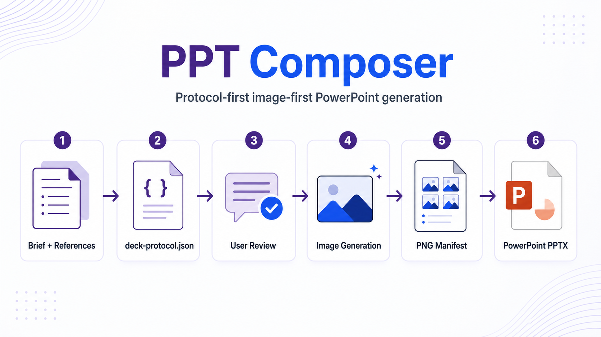

# PPT Composer

<p align="center">
  
</p>

<p align="center">
  <strong>Generate presentation-ready PowerPoint decks with one finished image per slide.</strong>
</p>

<p align="center">
  English | <a href="README.zh-CN.md">中文</a>
</p>

<p align="center">
  
  
  
  
  
</p>

PPT Composer is a Codex plugin for making image-first PowerPoint decks. You give Codex a brief, reference files, audience, style, and page count; the plugin plans the deck, asks you to review the plan, generates one complete PNG for each slide, and assembles those PNGs into a `.pptx`.

Use it when you want a polished deck that can be opened, presented, and shared immediately. It is not a native editable-slide generator: every final slide is one full-slide image.

<p align="center">
  
</p>

## Workflow

1. **Describe the deck**: topic, audience, page count, language, visual style, output folder, and any reference files.
2. **Parse references**: PDFs, images, tables, Markdown, Word files, and text briefs are converted into usable deck evidence.
3. **Review the protocol**: Codex writes `deck-protocol.json` and a readable `deck-protocol.review.md` summary before any image generation.
4. **Revise in plain language**: ask Codex to change page claims, bind figures, adjust fidelity, improve notes, or change the page-number policy.
5. **Confirm the protocol**: generation starts only after the plan is ready and approved.
6. **Generate slides**: each page becomes one finished PNG. Larger decks use bounded subagents for per-page image generation when available.
7. **Assemble and QA**: the plugin checks that every planned page has a real PNG, then creates the final PPTX.

The protocol is the contract: it records assets, page claims, reference bindings, fidelity mode, speaker notes, and output paths. If reference files are supplied, they must appear as assets and be bound to relevant pages before confirmation.

## Daily Use

In Codex, call the public skill:

```text
Use ppt-composer:image-first-ppt.
Create a <N>-slide deck from <brief/reference files>.
Audience: <who will listen>.
Language: <English/Chinese/etc.>.
Style: <academic / consulting / product / visual direction>.
Important requirements: <must-keep figures, logos, tables, page numbers, notes style>.
Output folder: <path>.
```

Example:

```text
Use ppt-composer:image-first-ppt.
Create a 10-slide Chinese academic report from ./paper.pdf and ./figures/.
Audience: robotics lab meeting.
Style: clean research-consulting, dark blue accents, clear evidence panels.
Requirements: keep the main result figure accurate, use speaker notes for a 5-minute talk, and use consistent page numbers.
Output folder: ./out/ppt-composer-demo.
```

Typical follow-up requests:

- “Make page 6 strict_embed and bind it to the main result figure.”
- “Remove visible source labels and internal asset ids from all slide images.”
- “Use page numbers on every slide except the cover.”
- “Rewrite speaker notes for a grant-review audience; make each note a real talk track, not one sentence.”
- “Regenerate only page 4 because the chart label is unclear.”

Useful user guides:

- [Chinese user guide](docs/user_guid/README.md)
- [Current use cases](docs/user_guid/current-use-cases.zh-CN.md)

## Installation

Requirements:

- Codex with plugin support
- Git available on `PATH` for GitHub marketplace installs
- Node.js 20+
- Optional: `uv/uvx` if you want MinerU-backed PDF, Office, or image parsing
- Optional: MinerU token for higher document-parsing limits and true extracted figure/image assets

### Install from GitHub

Make sure `git --version` works first. On Windows, install Git for Windows and reopen PowerShell/Codex before running:

```bash
codex plugin marketplace add YSAA1/PPT-Plugin
```

Then open Codex and install it from:

```text
/plugins
```

Choose **PPT Composer** and select **Install plugin**.

After installing, **start a new Codex thread** so the bundled skill and MCP servers are loaded. If the plugin browser or an older Codex session was already open, restart Codex before testing the plugin.

### Check document parsing setup

In Codex, ask:

```text
Run PPT Composer doctor.
```

Or from the installed plugin root. These `npm run ...` commands must be run in
the PPT Composer package directory, not from an arbitrary folder:

```bash
cd <plugin_root>
npm run prewarm
npm run prewarm:mineru
npm run doctor -- --create-env-template
```

The doctor reports whether `uvx`, MCP timeouts, PDF fallback, and `MINERU_API_TOKEN` are ready. Without a token, MinerU uses Flash/free mode; small PDFs can work, but large files and true figure extraction need a token. Put the token in the env file reported by doctor, then restart Codex.

### Set up a MinerU API token

This step is strongly recommended if you plan to use PPT Composer with PDFs, Office documents, scanned files, or reference images. PPT Composer can run without a token, but then MinerU falls back to Flash/free mode: limits are lower, output is Markdown-first, and real figure/image extraction may be unavailable. For research decks, paper reports, and strict reference-preservation workflows, create a MinerU API token before your first serious run.

Use a private env file; do not paste the token into prompts or commit it to Git.

1. Create an API token in your MinerU account.
2. Create the env template from the PPT Composer package directory. If you are
   using a local clone, run this from the repository root:

   ```bash
   npm --prefix plugins/ppt-composer run doctor -- --create-env-template
   ```

   If you installed from the Codex plugin marketplace, first ask Codex:

   ```text
   Run PPT Composer doctor.
   ```

   Then copy the reported `plugin_root` path and run:

   ```bash
   cd <plugin_root>
   npm run doctor -- --create-env-template
   ```

   Running `npm run doctor` from another directory, such as your home folder or
   a parent workspace without `package.json`, will fail with `Could not read
   package.json`.

3. Open the env file path reported by doctor and fill:

   ```env
   MINERU_API_TOKEN=your_mineru_api_token_here
   ```

   `MINERU_TOKEN` is also recognized for compatibility, but `MINERU_API_TOKEN` is the preferred name.

4. Restart Codex or start a new Codex thread so the MCP servers inherit the new environment.
5. Run `Run PPT Composer doctor.` again and confirm `mineru_token` is `ok` and mode is `full_api`.

If you installed from the Codex plugin marketplace, the env file usually lives under the installed plugin cache path shown by doctor, for example `~/.codex/plugins/cache/.../ppt-composer/<version>/.env`. You may also point `PPT_COMPOSER_ENV_FILE` to another private env file if you keep secrets in a central location.

### Install from a local clone

```bash
git clone https://github.com/YSAA1/PPT-Plugin.git
cd PPT-Plugin
codex plugin marketplace add .
```

Then open `/plugins`, choose **PPT Composer**, and select **Install plugin**. Start a new Codex thread after installation.

### Update an installed plugin

`codex plugin marketplace add` registers a marketplace source; it is not a hot update for already-loaded Codex threads. For a GitHub marketplace, refresh the source with:

```bash
codex plugin marketplace upgrade
```

Then reopen `/plugins` and install **PPT Composer** from the refreshed source again if needed. Start a new Codex thread or restart Codex so skills and MCP servers are loaded from the refreshed plugin cache.

If you installed from a local clone instead, pull the clone first, then run `codex plugin marketplace add .` again and reinstall from `/plugins`.

### If two PPT Composer entries appear

Codex lists plugins by marketplace source. The same plugin can appear twice if it is exposed by both a personal marketplace and a GitHub/repo marketplace. Keep one source and remove the other:

```bash
codex plugin marketplace remove <marketplace-name>
```

Then restart Codex. Installed plugin copies live under `~/.codex/plugins/cache/<marketplace-name>/<plugin-name>/<version>/`, so different marketplace names create separate cache entries.

## Outputs and Quality Boundaries

- Final PPTX: one full-slide PNG per page, with no PowerPoint text overlays.
- Speaker notes: generated by default from the audience and page content, then saved into PowerPoint notes.
- Review copy: `deck-protocol.review.md` summarizes the protocol for human review.
- Asset discipline: referenced images, tables, logos, and figures must be registered as protocol assets before use.
- Visual consistency: page numbers, footers, style, and metadata visibility are controlled by the protocol.
- No visible internals: slide images should not show raw filenames, asset ids, `source:` labels, file paths, or parser field names.
- Strict evidence mode: `strict_embed` pages must preserve referenced numbers, labels, logos, table headers, and captions.

## Troubleshooting

**The skill or MCP tools do not appear after install.**
Start a new Codex thread or restart Codex. The plugin registers the `ppt-composer:image-first-ppt` skill plus two MCP servers: `ppt-render-mcp` for rendering/assembly/QA and `mineru-open-mcp` for document parsing.

**`mineru-open-mcp` says `setup_required: true`.**
Install `uv/uvx`, then restart Codex. The core `ppt-render-mcp` server can still handle PPTX assembly even if MinerU parsing is not ready. Without a MinerU token, parsing uses Flash mode: Markdown is returned, and the plugin falls back to local PDF page images or input-image copies when possible; use `MINERU_API_TOKEN` when you need true extracted figures/images.

**The final PPTX is hard to edit.**
That is expected for image-first output. Use this plugin when visual consistency and presentation readiness matter more than native PowerPoint editability.

**The protocol looks wrong.**
Do not generate yet. Ask Codex to revise the protocol in plain language, then re-check `deck-protocol.review.md` before confirming image generation.

## Examples

| Example | Description |
| --- | --- |
| [halo-academic-tsinghua.pptx](plugins/ppt-composer/examples/decks/halo-academic-tsinghua.pptx) | Chinese academic research report deck with a Tsinghua-style visual direction. |
| [codex-introduction.pptx](plugins/ppt-composer/examples/decks/codex-introduction.pptx) | Codex introduction deck generated as an image-first PPTX. |

## License

MIT. See [LICENSE](LICENSE).
