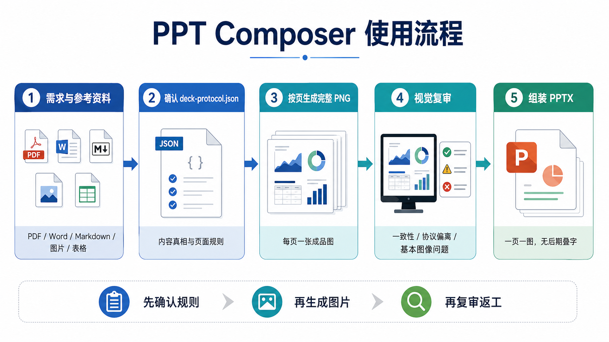

# 当前使用案例说明

本页说明 PPT Composer 目前最适合怎么用，以及每种场景下你应该怎么下指令、检查什么文件、如何返工。



## 案例 1：论文或报告生成科研汇报 PPT

适合：

- 论文阅读汇报；
- 组会报告；
- 项目阶段汇报；
- 研究 proposal 或 review deck。

示例指令：

```text
使用 ppt-composer:image-first-ppt。
基于 reference/paper.pdf 生成 12 页中文组会汇报 PPT。
受众：机器人与强化学习方向研究生。
风格：高端科研咨询，清晰、克制、信息密度适中。
第 5-8 页涉及实验结果，图表和关键数字必须 strict_embed。
输出到 output/paper-review.pptx。
```

你应该检查：

- 每页 claim 是否真的来自论文或你的 brief。
- 实验页是否使用 `strict_embed`。
- 图、表、关键数字是否绑定到了对应页面。
- 有没有页面内容过密，需要拆成两页。

## 案例 2：只有一句话需求，生成概念型 PPT

适合：

- 课程展示；
- 产品概念；
- 方案初稿；
- 没有强参考资料的主题介绍。

示例指令：

```text
使用 ppt-composer:image-first-ppt。
生成一份 8 页中文教学 PPT，主题是“什么是 AI Agent”。
受众：刚接触大模型工具的本科生。
风格：清晰、现代、适合课堂展示。
不需要严格引用资料，每页一个核心观点。
输出到 output/agent-intro.pptx。
```

你应该检查：

- 是否每页只有一个核心观点。
- 是否语言适合目标受众。
- 是否有不必要的术语。
- 图像风格是否统一。

## 案例 3：已有图片、logo、表格，生成定制化 PPT

适合：

- 有项目 logo；
- 有现成结果图；
- 有 CSV/TSV 表格；
- 有风格参考图；
- 需要按自己材料定制。

示例指令：

```text
使用 ppt-composer:image-first-ppt。
参考 reference/logo.png、reference/result-figure.png 和 reference/metrics.csv。
生成 9 页项目进展汇报 PPT。
logo 每页都要出现，但不要太抢眼。
result-figure 用在第 6 页，保真模式 strict_embed。
metrics.csv 生成一页指标对比图，允许 light_redraw，但数字不能改。
输出到 output/project-update.pptx。
```

你应该检查：

- logo 是否被加入 assets，并绑定到页面或全局风格。
- 表格是否变成结构化 evidence 或 source table。
- 关键图是否设置 `strict_embed`。
- 允许美化的表格页是否设置 `light_redraw`。

## 案例 4：图片生成后不好，只返工问题页

适合：

- 某一页文字不清楚；
- 某一页风格和其他页不一致；
- 某一页偏离协议；
- 某一页有水印、错字、变形、空白区域。


示例指令：

```text
第 4 页图像风格偏卡通，和其他页面不一致。只返工第 4 页，把 prompt 改成更克制的科研咨询风格，保持原 claim 和参考资料不变。
```

```text
第 7 页表格文字太小。只重生第 7 页，要求关键数字更大、更清晰，减少装饰元素。
```

```text
第 10 页偏离协议，没有表现出“部署成本下降”。先修改 deck-protocol.json 的 final_image_prompt，再只重生第 10 页。
```

你应该检查：

- 是否只标记问题页 `revision_requested`。
- 旧 PNG 是否保留为 superseded attempt。
- 新 PNG 是否重新进入视觉复审。
- 最终 manifest 是否只使用 accepted PNG。

## 案例 5：严格保留图表、logo、数字

适合：

- 论文图表；
- 评测结果；
- 业务指标；
- 品牌 logo；
- 不能被模型自由发挥的材料。

示例指令：

```text
第 6 页必须严格保留 reference/main-table.png 的表头、数值和图注。
请把第 6 页设置为 strict_embed。
如果视觉复审发现数字或表头变化，直接 fail，不要组装。
```

你应该检查：

- `fidelity` 是否为 `strict_embed`。
- `reference_asset_ids` 是否包含正确 asset id。
- `content_inputs.images` 或 `content_inputs.tables` 是否绑定正确。
- 视觉复审是否把数字、曲线、logo、图注变化视为失败。

## 当前边界

PPT Composer 当前主打 image-first 输出：

- 优点：视觉完成度高、跨设备展示稳定、不会因为字体或布局漂移破坏效果。
- 代价：PPT 里的页面内容不是一个个可编辑文本框，而是一张完整图片。

它适合“我要一个能展示、能分享、风格统一的 PPT”。如果你当前最需要的是每个文本框都可编辑的传统 PPT，应该在需求里明确说明，避免误用 image-first 输出。

## 仓库内示例

你可以打开这些示例了解效果：

| 示例 | 说明 |
| --- | --- |
| `plugins/ppt-composer/examples/decks/halo-academic-tsinghua.pptx` | 中文学术科研汇报示例。 |
| `plugins/ppt-composer/examples/decks/codex-introduction.pptx` | Codex 介绍 image-first 示例。 |

